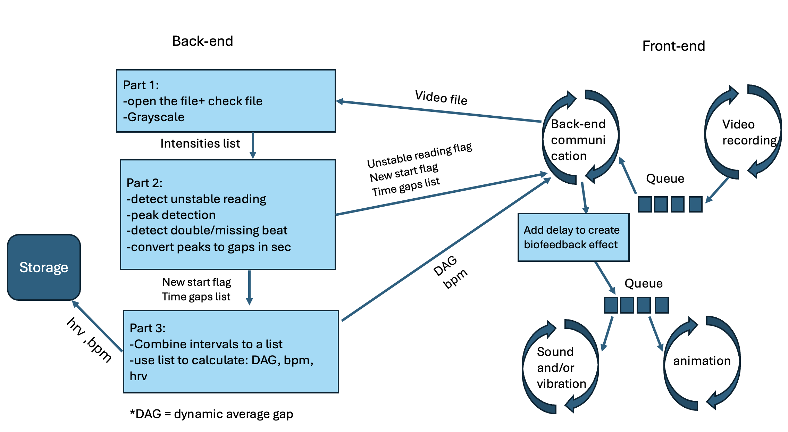
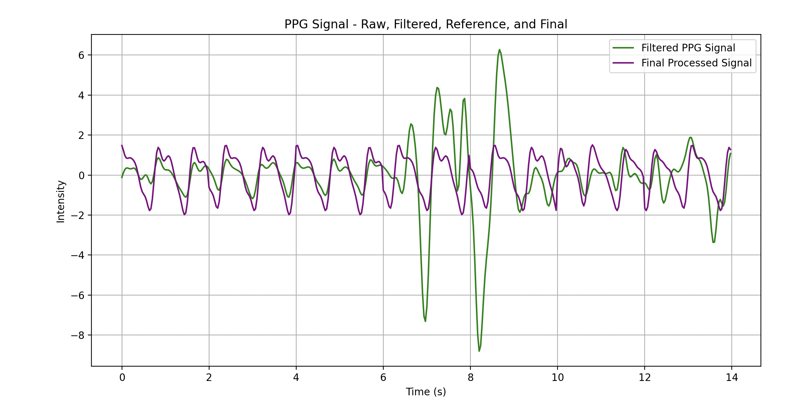
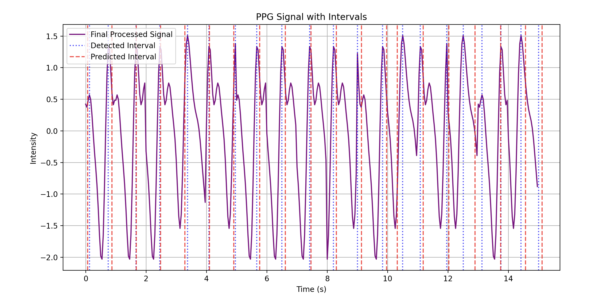

# HEART RATE MONITOR AND BIOFEEDBACK APP
This app detects the user's pulse using LMS, AR, and PPG algorithms, creating a real-time biofeedback effect.
It leverages Machine Learning to predict future beats, enabling 'real-time' feedback—something not seen in other pulse detection apps.
Users can choose between three feedback types: haptic, audio, or visual, allowing for experimentation on how different sensory feedback affects the body and mind.
## Demo video 
https://youtube.com/shorts/Rb5UknezLIk?feature=share
## About
This app was created as part of a practicum in Amir Amedi's Neuroscience lab, during my Computer Science and Neuroscience degree.
It was designed especially for an expirament on heart biofeedback for chronic pain.
## Technologies and Tools
### Architecture

### Machine learning

The app use LMS for cleaning the signal (upper graph), and AR for predicting the future beats- enabling biofeedback effect.

### Backend:
Written in Python, using Flask as the framework.
Using Azure for Cloud and DB sources.
### Frontend:
Written in Dart, using Flutter as the framework.
Deployed using Xcode and an Apple developer account.
## Setup (for lab colleagues)
To use this app, you must have a basic Azure account and an Apple developer account, which allows you to deploy the app on up to 100 devices.
